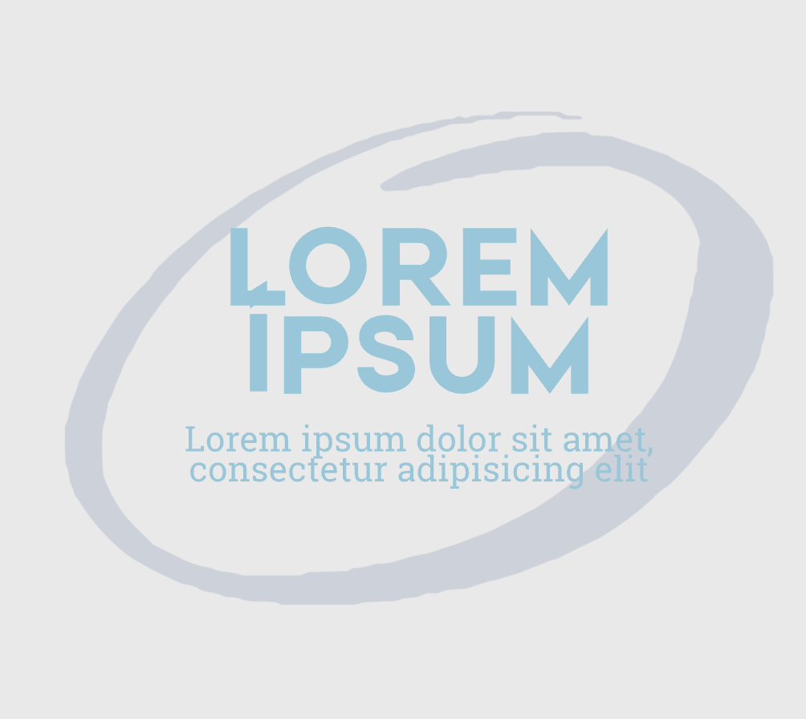
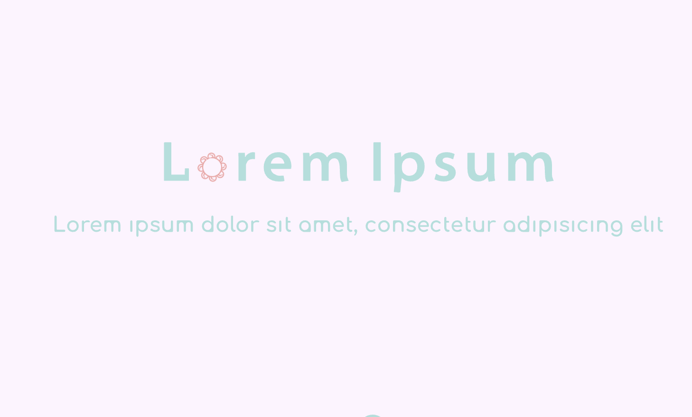

# Lorem ipsum
`Lorem ipsum` dolor sit amet, consectetur adipisicing elit, sed do eiusmod tempor incididunt ut labore et dolore magna aliqua. Ut enim ad minim veniam, quis nostrud exercitation ullamco laboris nisi ut aliquip ex ea commodo consequat. Duis aute irure dolor in reprehenderit in voluptate velit esse cillum dolore eu fugiat nulla pariatur. Excepteur sint occaecat cupidatat non proident, sunt in culpa qui officia deserunt mollit anim id est laborum. 

```
Lorem ipsum dolor sit amet, consectetur adipisicing elit, sed do eiusmod tempor incididunt ut labore et dolore magna aliqua. Ut enim ad minim veniam, quis nostrud exercitation ullamco laboris nisi ut aliquip ex ea commodo consequat. Duis aute irure dolor in reprehenderit in voluptate velit esse cillum dolore eu fugiat nulla pariatur. Excepteur sint occaecat cupidatat non proident, sunt in culpa qui officia deserunt mollit anim id est laborum. 
```

[Link to another page](another-page)

## link

[Link to Yahoo.co.jp](https://www.yahoo.co.jp)

```
[Link to Yahoo.co.jp](https://www.yahoo.co.jp)
```

## summary
<details>
<summary>Summary (click to show detail)</summary>
Lorem ipsum dolor sit amet, consectetur adipisicing elit, sed do eiusmod tempor incididunt ut labore et dolore magna aliqua. Ut enim ad minim veniam, quis nostrud exercitation ullamco laboris nisi ut aliquip ex ea commodo consequat. Duis aute irure dolor in reprehenderit in voluptate velit esse cillum dolore eu fugiat nulla pariatur. Excepteur sint occaecat cupidatat non proident, sunt in culpa qui officia deserunt mollit anim id est laborum. 
</details>
```
<details>
<summary>Summary (click to show detail)</summary>
Lorem ipsum dolor sit amet, consectetur adipisicing elit, sed do eiusmod tempor incididunt ut labore et dolore magna aliqua. Ut enim ad minim veniam, quis nostrud exercitation ullamco laboris nisi ut aliquip ex ea commodo consequat. Duis aute irure dolor in reprehenderit in voluptate velit esse cillum dolore eu fugiat nulla pariatur. Excepteur sint occaecat cupidatat non proident, sunt in culpa qui officia deserunt mollit anim id est laborum. 
</details>
```

## text decoration

*This text will be italic* _This will also be italic_

**This text will be bold** __This will also be bold__

_You **can** combine them_

~~deleted words~~


```
*This text will be italic* _This will also be italic_

**This text will be bold** __This will also be bold__

_You **can** combine them_

~~deleted words~~

```

## table

|  TH  |  TH  |
| ---- | ---- |
|  TD  |  TD  |
|  TD  |  TD  |

```
|  TH  |  TH  |
| ---- | ---- |
|  TD  |  TD  |
|  TD  |  TD  |
```

## image

```

``` 

if you want to resize:
```



``` 


## Definition
<dl>
  <dt>リンゴ</dt>
  <dd>赤いフルーツ</dd>
  <dt>オレンジ</dt>
  <dd>橙色のフルーツ</dd>
</dl>

```
<dl>
  <dt>リンゴ</dt>
  <dd>赤いフルーツ</dd>
  <dt>オレンジ</dt>
  <dd>橙色のフルーツ</dd>
</dl>

```

## check box
- [ ] タスク1
- [x] タスク2

```
- [ ] タスク1
- [x] タスク2
```

## blockquote
> 文頭に>を置くことで引用になります。
> 複数行にまたがる場合、改行のたびにこの記号を置く必要があります。
> > これはネストされた引用。

```
> 文頭に>を置くことで引用になります。
> 複数行にまたがる場合、改行のたびにこの記号を置く必要があります。
> > これはネストされた引用。
```

## Horizontal rules
---
```
---
```

## Bullet
- Lorem ipsum dolor sit amet. 
  - Id sunt consequatur et sapiente fuga eum autem voluptates aut quia distinctio.
  - Id sunt consequatur et sapiente fuga eum autem voluptates aut quia distinctio.
- Non accusantium voluptatem quo sequi fugit ut internos omnis.
```
- Lorem ipsum dolor sit amet. 
  - Id sunt consequatur et sapiente fuga eum autem voluptates aut quia distinctio.
  - Id sunt consequatur et sapiente fuga eum autem voluptates aut quia distinctio.
- Non accusantium voluptatem quo sequi fugit ut internos omnis.
```


## Enumerate
1. Lorem ipsum
	1. Lorem ipsum
	1. Lorem ipsum
1. Lorem ipsum

```
1. Lorem ipsum
	1. Lorem ipsum
	1. Lorem ipsum
1. Lorem ipsum
```


## Code Snippets

```
.my-link {
    text-decoration: underline;
}
```

````
```
.my-link {
    text-decoration: underline;
}
```
````

### Syntax Highlighting

```javascript
function fancyAlert(arg) {
  if(arg) {
    $.facebox({div:'#foo'})
  }
}
```

````
```javascript
function fancyAlert(arg) {
  if(arg) {
    $.facebox({div:'#foo'})
  }
}
```
````

## footnote
The quick brown fox[^1] jumped over the lazy dog[^2].

[^1]: Foxes are red
[^2]: Dogs are usually not red


# 1st level header
## 2nd level header
### 3rd level header
#### 4th level header
##### 5th level header
###### 6th level header

```
# 1st level header
## 2nd level header
### 3rd level header
#### 4th level header
##### 5th level header
###### 6th level header
```