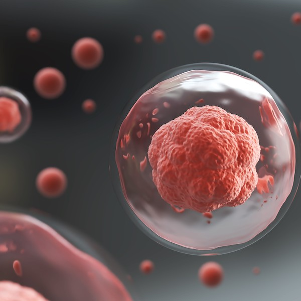

---
---
<!-- Main jumbotron for a primary marketing message or call to action -->

 <!--; -->
  

    

# TopGene
Single Cell Data Analysis Project

###### [© ASHBi, Kyoto University.](https://ashbi.kyoto-u.ac.jp/){:target="_blank"}

      
<a class="btn btn-primary btn-lg" href="{{ site.baseurl }}/docs/introduction" role="button">Get started&raquo;</a>

    

  

  
    
    

      

        

  TopGene is a single-cell data analysis project launched at ASHBi, Kyoto University. 
  This project provids novel data analysis methods for large-scale single cell data such as scRNA-seq and scATAC-seq data. 
  The TopGene softwares can reviel new biological insights with single cell resolutions. 

  
    
    

      

[{:height="300" width="300"}](RECODE)
        
## [RECODE](RECODE)
Noise reduction method for single-cell sequencing data. 

        
<a class="btn btn-default" href="{{ site.baseurl }}/RECODE" role="button">View details &raquo;</a>

      

    

    

      

[{:height="300" width="300"}](V-Mapper)

## [V-Mapper](V-Mapper)
Topological trajectory inference method for cell differentiation. 

        
<a class="btn btn-default" href="{{ site.baseurl }}/V-Mapper" role="button">View details &raquo;</a>
        
      

    

  

  
  <!-- START THE FEATURETTES -->
  
  

  
  

    

<!-- 
## [PickUp1](V-Mapper)

{:.lead}
このようなことができます。

    

    

[{:height="300" width="300" class="featurette-image img-responsive center-block"}](V-Mapper)

    

  

  
  
  

  
  

    

## [PickUp2](RECODE)

{:.lead}
Many researchers are using .... 

    

    

[{:height="300" width="300" class="featurette-image img-responsive center-block"}](RECODE)

    

  

-->
  
  

  

  
